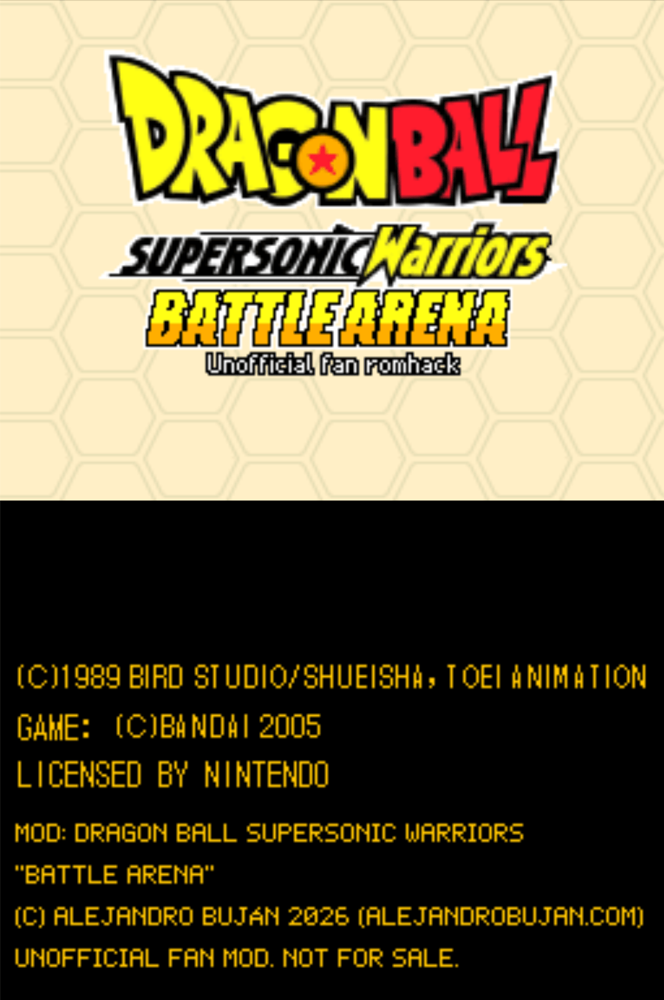

<h1 align="center">Dragon Ball Supersonic Warriors “Battle Arena”</h1>

  <em>Fan romhack of <b>Dragon Ball Z: Supersonic Warriors 2</b></em> 
  Nintendo DS · Europe

  <a href="https://github.com/alejandrobujan/dbsw-battle-arena/releases/latest"><b>Download v1.0</b></a>
  &nbsp;·&nbsp; <a href="#english">English</a>
  &nbsp;·&nbsp; <a href="#español">Español</a>
  &nbsp;·&nbsp; <a href="#license--licencia">License</a>

© 2026 <a href="https://alejandrobujan.com">Alejandro Buján</a>

> [!NOTE]
> Unofficial fan mod. Not for sale. Not affiliated with or endorsed by Bandai Namco,
> Toei Animation, Bird Studio/Shueisha or Nintendo. This repository contains only a
> patch: you need your own copy of the game.

## English

A pure fighting version of Supersonic Warriors 2: the game boots straight into Free
Battle team select and never leaves it. The battle engine is the original one.

Several new characters never seen in the original Supersonic Warriors games are
waiting to be unlocked in battle. Find out who they are.

### How to patch

1. You need a dump of **your** cartridge of *Dragon Ball Z: Supersonic Warriors 2*
   (Europe), game code `ADBP`. It must match:

   | | |
   |---|---|
   | SHA-1 | `6681ae01620e736d7428f4bbd84b2388134d5c2b` |
   | MD5 | `dffae2dfce8cb052197094d488b96042` |
   | CRC32 | `0e001277` |

2. Apply [`patch/DBSW-BattleArena-v1.0.xdelta`](patch/DBSW-BattleArena-v1.0.xdelta) to it with any xdelta tool:
   - [Rom Patcher JS](https://www.marcrobledo.com/RomPatcher.js/) (in a browser)
   - Delta Patcher (Windows / macOS / Linux)
   - command line: `xdelta3 -d -s original.nds DBSW-BattleArena-v1.0.xdelta battle_arena.nds`
3. The patched ROM must match:

   | | |
   |---|---|
   | SHA-1 | `7459304a5856cb8ebaf7cf683ba84a15bfa8c7e2` |
   | MD5 | `819fb4fc5b1d0429f7b30cab520bd36e` |

4. Play it on a flashcart or an emulator (melonDS, DeSmuME…).

### Credits & reuse

If you build on this hack (a patch on top of it, a port, a video, a translation…),
please credit **Alejandro Buján** ([alejandrobujan.com](https://alejandrobujan.com)) and
link this repository. That is also what the license below asks for.

### Contributing & contact

Contributions are very welcome: bug reports, ideas, new characters, art, translations.
Open an issue or write to **[hi@alejandrobujan.com](mailto:hi@alejandrobujan.com)**.

## Español

Una versión de puro combate de Supersonic Warriors 2: el juego arranca directamente
en la selección de equipos de Free Battle y no sale de ahí. El motor de combate es el
original.

Unos cuantos personajes nuevos, inéditos en la saga original de Supersonic Warriors,
esperan a ser desbloqueados combatiendo. Descubre quiénes son.

### Cómo parchear

1. Necesitas un volcado de **tu** cartucho de *Dragon Ball Z: Supersonic Warriors 2*
   (Europa), código `ADBP`. Debe coincidir con:

   | | |
   |---|---|
   | SHA-1 | `6681ae01620e736d7428f4bbd84b2388134d5c2b` |
   | MD5 | `dffae2dfce8cb052197094d488b96042` |
   | CRC32 | `0e001277` |

2. Aplícale [`patch/DBSW-BattleArena-v1.0.xdelta`](patch/DBSW-BattleArena-v1.0.xdelta) con cualquier herramienta xdelta:
   - [Rom Patcher JS](https://www.marcrobledo.com/RomPatcher.js/) (en el navegador)
   - Delta Patcher (Windows / macOS / Linux)
   - línea de comandos: `xdelta3 -d -s original.nds DBSW-BattleArena-v1.0.xdelta battle_arena.nds`
3. La ROM parcheada debe coincidir con:

   | | |
   |---|---|
   | SHA-1 | `7459304a5856cb8ebaf7cf683ba84a15bfa8c7e2` |
   | MD5 | `819fb4fc5b1d0429f7b30cab520bd36e` |

4. Juega en una flashcart o un emulador (melonDS, DeSmuME…).

### Créditos y reutilización

Si construyes sobre este hack (un parche encima, un port, un vídeo, una traducción…),
menciona a **Alejandro Buján** ([alejandrobujan.com](https://alejandrobujan.com)) y enlaza
este repositorio. Es también lo que pide la licencia de abajo.

### Colaboraciones y contacto

Las colaboraciones se agradecen mucho: avisos de fallos, ideas, personajes nuevos, arte,
traducciones. Abre un issue o escribe a **[hi@alejandrobujan.com](mailto:hi@alejandrobujan.com)**.

## License / Licencia

The original work in this hack (its changes to the game, code and new art) by Alejandro
Buján is licensed under
[**CC BY-NC-SA 4.0**](https://creativecommons.org/licenses/by-nc-sa/4.0/) (see [`LICENSE`](LICENSE)):
you may share and adapt it, giving credit, not for commercial purposes, and under the same
license. It does not cover the game itself, its characters or its original graphics,
which belong to their owners.

El trabajo original de este hack (sus cambios al juego, código y arte nuevo) de Alejandro
Buján tiene licencia
[**CC BY-NC-SA 4.0**](https://creativecommons.org/licenses/by-nc-sa/4.0/deed.es) (ver [`LICENSE`](LICENSE)):
puedes compartirlo y adaptarlo dando crédito, sin fines comerciales y con la misma licencia.
No cubre el juego en sí, sus personajes ni sus gráficos originales, que pertenecen a sus
dueños.

---

Dragon Ball © Bird Studio/Shueisha, Toei Animation. Supersonic Warriors 2 © Bandai 2005.
All trademarks belong to their owners. Made by a fan, for fans, free of charge.
